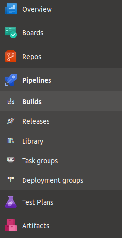
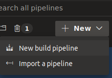
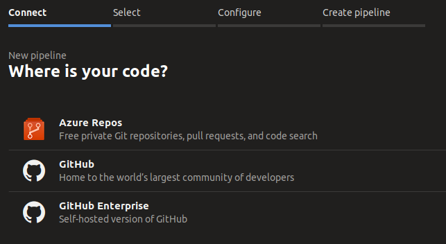
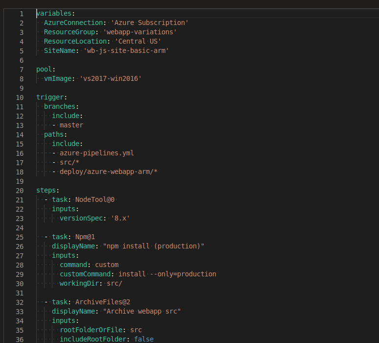
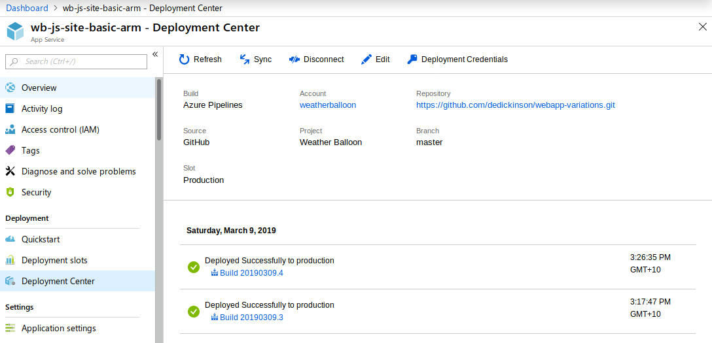

# Variation: Azure Web App via Azure DevOps

In this variation I'll use [Azure DevOps](https://azure.microsoft.com/en-us/services/devops/?nav=min)
to build and deploy the web app to an [Azure Web App](https://azure.microsoft.com/en-us/services/app-service/web/).

Azure Web Apps are a really good approach to running up a web application - 
you don't need to run any infrastructure but you have flexibility in terms of
scaling, security, languages etc.

This variation relies on `azure-pipelines.yml` (in the project root) to define
the [Azure DevOps pipeline](https://docs.microsoft.com/en-us/azure/devops/pipelines/get-started/key-pipelines-concepts?view=azure-devops#pipeline).  

## Step 1: Fork this repository

Log into GitHub and head to https://github.com/dedickinson/webapp-variations. 
You can then click on the "Fork" button to get your own copy.

## Step 2: Sign into Azure DevOps

Head over to [Azure DevOps](https://azure.microsoft.com/en-us/services/devops/?nav=min) and 
create an account or sign in if you already have one. 

If you're creating an account, use the same one you use when working with Azure - 
it'll just make life easier.

Once you're logged in, follow the instructions linked below:

1. [Create an organisation](https://docs.microsoft.com/en-us/azure/devops/organizations/accounts/create-organization?view=azure-devops)
1. [Create a project](https://docs.microsoft.com/en-us/azure/devops/organizations/projects/create-project) in your organisation (if you don't want to use the project created when setting up the organisation)

## Step 3: Create a connection to your Azure Subscription

You'll need to [create an Azure service connection](https://docs.microsoft.com/en-us/azure/devops/pipelines/library/connect-to-azure?view=azure-devops) so that your DevOps environment can interact with Azure. 
Follow the link just provided to set up the connection. I'd suggest you name the connection 'Azure Subscription' 
as this is what is used in the pipeline configuration.

## Step 4: Configure the DevOps Pipeline Build

1. Click on the `Pipeline` item: 

    

1. Select the `New` menu and click on `New build pipeline`: 

    

1. On the _"Where is your code?"_ screen, click on _GitHub_

    

You'll see a list of your repositories, select the one you just forked into.

You'll likely see a screen titled _"Install Azure Pipeline"_ - this is actually
a GitHub screen configuring access to your account. Follow the process to configure
your GitHub account and you'll be returned to Azure DevOps.

Azure Pipelines will pickup that there's a file named `azure-pipelines.yml` in the
root directory of the repository: 

You'll need to edit the variables section:

* Change `SiteName` to something you'd like - this prevents the Web App from trying to push to the same domain name
* If the Azure connection you created in Step 3 wasn't named `Azure Subscription`, change this variable to match the name you used.

Take a read through the `azure-pipelines.yml` content and you'll see it:

1. Runs `npm install --only=production` to install the required modules
1. Packages up your site as a zip archive (allowing you download this as a build artifact)
1. Deploys the Azure resources defined in [template.json](arm/template.json)
1. Deploys the site code to the Azure Web App

You can now click `Run` and get the build configured. 
When you've clicked `Run`, the screen displays that it's configuring the build 
but _may_ not move off the screen when it's complete. Don't click on the `Run` 
button a second time - instead, select the `Builds` item in the `Pipelines` 
menu on the left side of the window.

## Step 5: Check out your website

Jump into the Azure Portal and browse to the Web App. You'll see the link
to the app on the _Overview_ page. You can also view this info using the
`az` cli:

    az webapp list --query "[].{name: name, hostName: defaultHostName, state: state}" -o table

_Note_: You need to use `https` to access the site.

While you're in the portal, go to the _Deployment Center_ menu item and
you'll see your recent builds listed there:

## Conclusion

Hopefully you got the site up and running and are now thinking about ways
to improve aspects such as security and monitoring. It's also a basic example
of a pipeline and you'll likely want to run tests, deploy to dev/test/prod etc.

I'll leave you with one thought: _do you need a dynamic web app?_. With 
dynamic behaviour comes security issues and there are a lot of static site
generators available that could be used for turning your content into a static
web site. If this sounds useful to you, why not look at 
[Static website hosting in Azure Storage](https://docs.microsoft.com/en-us/azure/storage/blobs/storage-blob-static-website)?

You might also consider breaking your layout & content from the more dynamic 
elements and go for hosting a static [single-page application (SPA)](https://en.wikipedia.org/wiki/Single-page_application)
that uses a framework such as [React](https://reactjs.org/) to call an API.
In the case of my example web application this would mean I'd build a React-based SPA
that called my `random` API. The SPA could be hosted in a Storage Account static site
and I'd continue hosting the trimmed down app as an [API App](https://azure.microsoft.com/en-us/services/app-service/api/)
(which is pretty much the same thing as a Web App). I could trim down my API code even further and 
use [Azure Functions](https://docs.microsoft.com/en-us/azure/azure-functions/).

As always, there's a lot of options to consider...

## References

* [Create a Node.js web app in Azure](https://docs.microsoft.com/en-us/azure/app-service/app-service-web-get-started-nodejs#create-a-web-app)
* [ARM Template reference for Web Apps](https://docs.microsoft.com/en-us/azure/templates/microsoft.web/allversions)
* [Azure DevOps YAML schema](https://docs.microsoft.com/en-us/azure/devops/pipelines/yaml-schema?view=azure-devops&tabs=schema)
